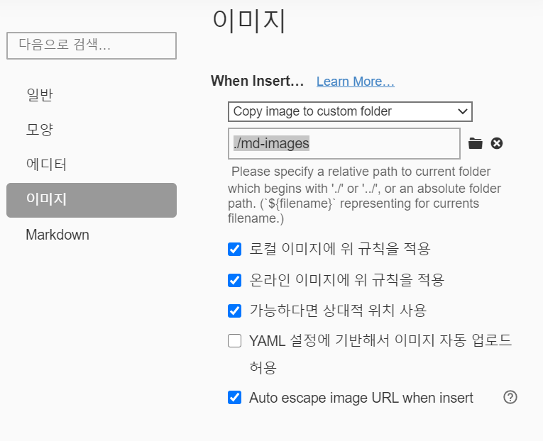

# 마크다운 문법

## 제목(heading)

제목은 `#`을 통해 표현 한다. 제목의 레벨은 h1~h6까지 표현가능하다.

### 제목3

#### 제목4

##### 제목5

###### 제목6

## 목록

1. 순서가 있는 목록 엔터
2.  순서가 있는 목록
   1. tab을 누르면 하위 레벨에서 작성
   2. 하위 레벨
3.  shift+tab을 누르면 상위 레벨로 올라옴

엔터를 두번 누르면 아예 밖으로 나올수 있음

* '*'을 누르면 순서가 없는 목록
  * tab을 누르면 역시 하위레벨에서 작성
* shift + tab을 누르면 상위 레벨로 올라옴

## 코드블록

(```)를 사용해서 해당 언어에 맞는 코드를 입력할수 있다

```python
print('hi')
# 파이썬 주석
```


```html
<!-- HTML주석-->

print('hi')
<h1>
    hi
</h1>
```

* tip : 코드를 저장할때, 다른 문서 프로그램에 비해 좀 더 효율적으로 기록할 수 있다, 때문에 일반적으로 마크다운을 사용해서 개발자가 정리를 한다.


## 링크

[구글링크!](http://google.com)

[네이버!](http:// naver.com)

구글[^1]

[^1]:http://google.com


* | 순번 | 이름 | 성별 | 비고 |
  | ---- | ---- | ---- | ---- |
  | 1    |      |      |      |
  | 2    |      |      |      |
  | 3    |      |      |      |

## 그림



## 기타

*기울임 *

** 굵게 **

---취소선---

>  인용문

​	


[^1]: 